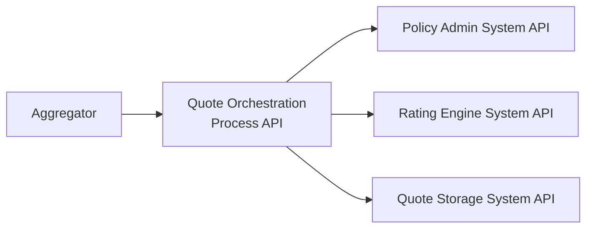
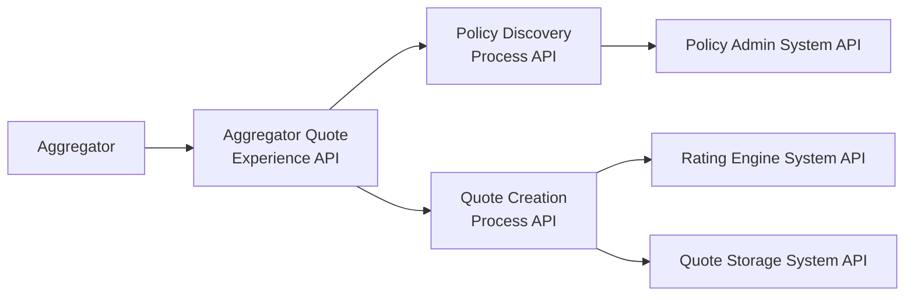
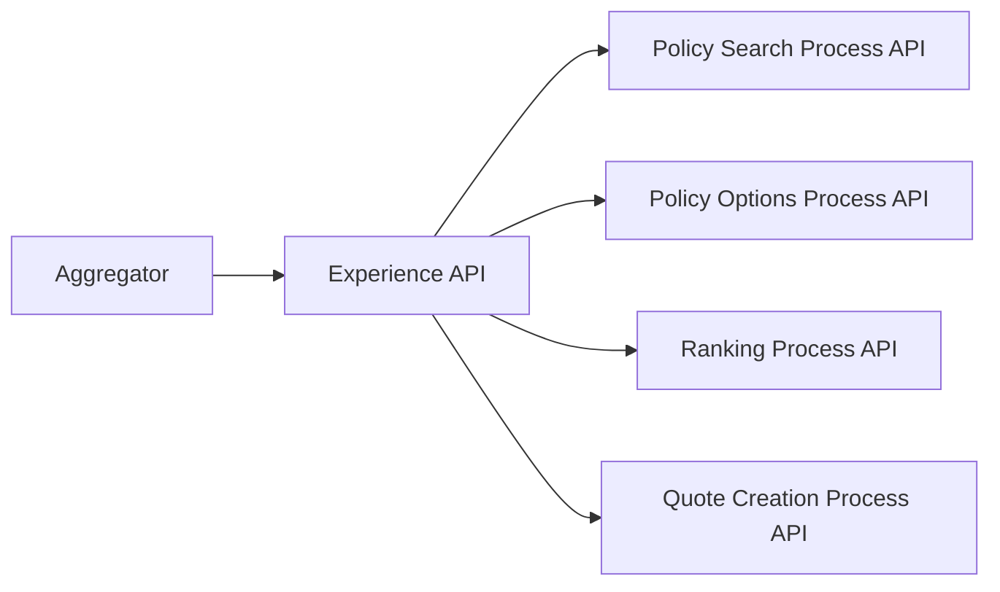

# API-Led Design for "Create Quote for Aggregators" Feature

This document outlines possible API-led connectivity designs for the "Create Quote for Aggregators" feature, focusing on the **Process API** layer granularity.

---

## 1. Design Principle
Process APIs should be split **only** when there is a clear functional, operational, or organizational reason. Examples include:
- **Distinct capabilities** (different teams or release cadences)
- **Real reuse** by multiple channels (web, mobile, partners)
- **Technical/functional boundaries** (transactions, security/PII, SLAs, throttling)
- **Separate lifecycle** (independent versions and roadmaps)
- **Performance reasons** (avoid chatty APIs or isolate heavy workloads)

If none of the above apply, keep steps together in the same Process API.

---

## 2. Design Options

### **Option A — Single Process API (Orchestration)**
Best for time-to-market and simplicity.

**Example endpoints:**
- `POST /quotes` → handles search, options retrieval, ranking, and quote creation
- `GET /quotes/{id}` → retrieve a quote

**Use when:** Single domain/team, low reuse of intermediate steps.

---

### **Option B — Two Process APIs (Natural Partition)**
Separates **discovery** from **quote creation** — most common pattern.

**Example endpoints:**
- **Policy Discovery Process API**:
  - `GET /policyholders/{id}`
  - `GET /policies/{id}/options`
- **Quote Creation Process API**:
  - `POST /quotes`
  - `POST /quotes/rank`
  - `GET /quotes/{id}`

**Use when:** Discovery is reused by other channels (e.g., internal portal) and quote creation has its own SLAs, policies, and scaling needs.

---

### **Option C — Three to Four Process APIs (Dedicated Capabilities)**
Only if each step is a separate **capability** with its own **team, rules, and scaling**.

**Use when:** Ranking is a generic engine reused across multiple products/channels, and search/options serve multiple domains.

---

## 3. Recommendation for Aggregator Quotes
For this specific case, **Option B (2 Process APIs)** is recommended:
1. **Policy Discovery Process API** — searches policy holder and retrieves available options (likely reused in other channels).
2. **Quote Creation Process API** — ranks options and creates quotes (may have distinct SLAs, governance, and scaling).

If in the future the **ranking engine** becomes a shared capability across domains, it can be promoted to its own Process API (Option C). Otherwise, keep it within Quote Creation.

---

## 4. Practical Notes
- **One Mule application can expose multiple APIs** — you can start with both processes in the same app and split later when there’s a reason (deployment, scaling, ownership).
- Keep the **Experience API thin** (validation, contract adaptation) and the **Process API thick** (orchestration, business logic).
- Avoid **chatty Process APIs** (multiple small sequential calls over the network); if a step is purely internal, implement it inside the same API.
- Define **metrics** to validate your choice: end-to-end latency, reuse of “discovery” endpoints, deploy cadence per domain.
