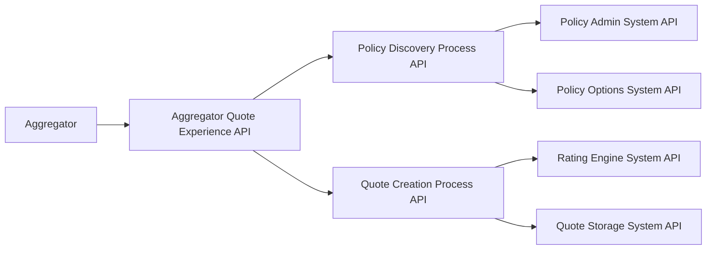

# API-Led Design for "Create Quote for Aggregators" — Option 2 (Two Process APIs)

This document describes the API-led design for the *Create Quote for Aggregators* feature, based on the business process provided, and justifies the choice of **Option 2 — Two Process APIs**.

---

## 1. Why Option 2?
We have chosen **Two Process APIs** because:
- The **discovery** process (searching for policy holder and retrieving policy options) can be **reused** by other channels (e.g., internal portals, other partners, mobile apps).
- The **quote creation** process (ranking and creating quotes) is a **distinct capability** with:
  - Separate **SLAs** (service-level agreements)
  - Different **policies** (security, throttling)
  - Potentially higher computational cost (ranking algorithms, premium calculations)
- Splitting these processes:
  - Improves **maintainability** — changes to one process won’t necessarily impact the other
  - Allows **independent scaling** — quote creation may require more resources than discovery
  - Enables **clearer governance** and lifecycle management per capability

---

## 2. Mapping from the Business Process Flow

**Original high-level flow from the exercise:**  
```
Aggregator Policy Description Received
    → Search Policy Holder
    → Retrieve Available Policy Options
    → Rank Policy Options
    → Create Quotes for Top Policy Options
    → Quotes Delivered to Aggregator
```

**Mapped into API-led layers:**



---

## 3. API Descriptions

### **Experience API**
- **Aggregator Quote Experience API**
  - **Purpose:** Interface for aggregators to request quotes in their expected format
  - **Endpoints:**
    - `POST /quotes`
    - `GET /quotes/{id}`
  - **Responsibilities:**
    - Validate incoming requests
    - Adapt data formats
    - Route calls to the appropriate Process APIs

---

### **Process APIs**
#### **1. Policy Discovery Process API**
- **Purpose:** Handle search of the policy holder and retrieval of available policy options.
- **Endpoints:**
  - `GET /policyholders/{id}`
  - `GET /policies/{id}/options`
- **Responsibilities:**
  - Orchestrate calls to the Policy Admin and Policy Options System APIs
  - Apply business rules for filtering available options

#### **2. Quote Creation Process API**
- **Purpose:** Rank available policy options and create quotes for the top-ranked ones.
- **Endpoints:**
  - `POST /quotes`
  - `POST /quotes/rank`
  - `GET /quotes/{id}`
- **Responsibilities:**
  - Call the Rating Engine System API to calculate premiums
  - Rank policy options based on defined rules
  - Store final quotes in the Quote Storage System

---

### **System APIs**
- **Policy Admin System API** — access to policyholder and policy details
- **Policy Options System API** — retrieval of available options for a policy
- **Rating Engine System API** — premium calculation
- **Quote Storage System API** — persistence and retrieval of quotes

---

## 4. Benefits of Option 2
- **Reusability:** Policy Discovery can be consumed by other processes beyond aggregators.
- **Performance Optimization:** Quote Creation can be scaled independently if it becomes the bottleneck.
- **Clear Ownership:** Different teams can own Discovery and Quote Creation APIs.
- **Governance:** Easier to apply specific policies (e.g., stricter throttling on quote creation due to complexity).

---

## 5. Summary
Choosing Option 2 strikes a balance between **simplicity** and **flexibility** — it avoids over-fragmentation of the Process layer while still separating two logically distinct business capabilities. This ensures the solution is future-proof for reuse, scaling, and governance without introducing unnecessary complexity.
